# Final Project: IN-OUT Registers for VSM

## Project Overview

In this project, we are using the muddlib library to create parts of a Very Simple Microprocessor (VSM). We are creating the In Register and Out Register which store the data for input and output until a signal is sent to enable the data to be processed. They are both registers that serve similar purposes in different ways, playing crucial roles in the microprocessor's data flow architecture.

## IN Register

The In Register uses tristates with enable pins to allow the input data to be sent to IB_BUS when an enable signal is triggered. This design allows the register to control when data is placed on the shared bus, implementing proper bus arbitration through high-impedance states.

### Schematic

The IN Register is implemented using tristate buffers that can drive the bus or enter a high-impedance state based on the EnableIn control signal. This allows multiple devices to share the same bus without interference.

  

  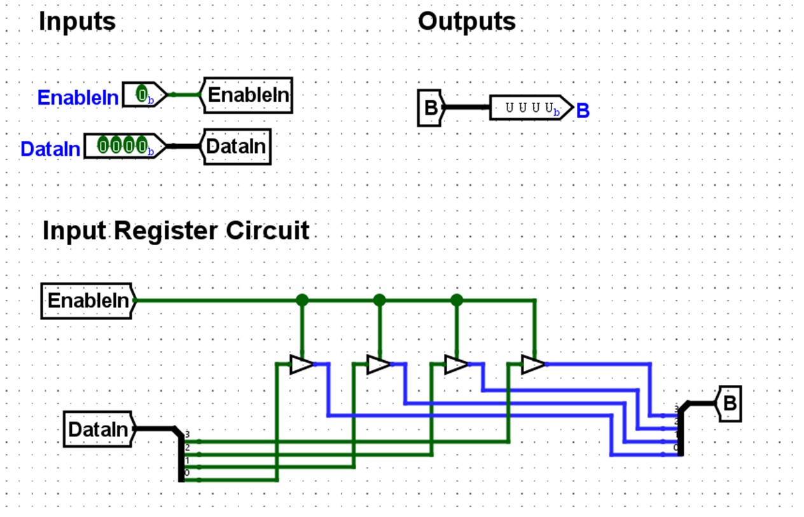
  
<em>Figure 1: IN Register Schematic Implemented Using Tristate Buffers (Logisim)</em>

  

  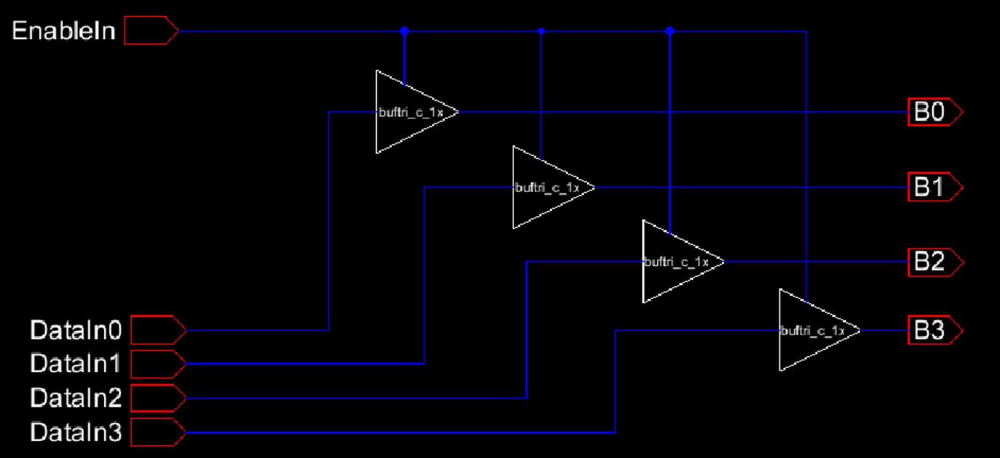
  
<em>Figure 2: IN Register Transistor-Level Schematic with Tristate Buffers</em>

  

### Simulation

The simulation demonstrates the proper operation of the tristate buffers under different enable conditions.

#### EnableIn = 1 (Driving the Bus)

When EnableIn is high (logic 1), the tristate buffers are active and drive the DataIn values onto the B bus outputs. This allows the IN Register to place data on the shared bus for other components to read.

  

  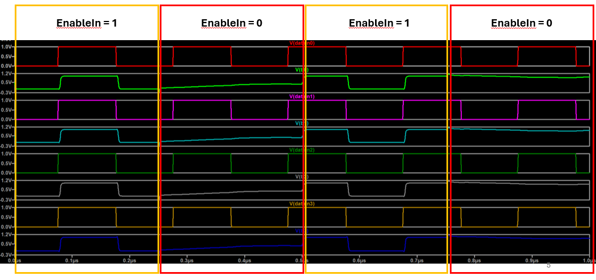
  
<em>Figure 3: SPICE Simulation of IN Register When EnableIn = 1 (Actively Driving Bus)</em>

  

#### Changing EnableIn (Showing High-Impedance Behavior)

This simulation shows the critical behavior of the tristate buffers as EnableIn toggles between 1 and 0. When EnableIn transitions to 0, the outputs enter a high-impedance (Hi-Z) state, effectively disconnecting from the bus and allowing other devices to use it without contention.

  

  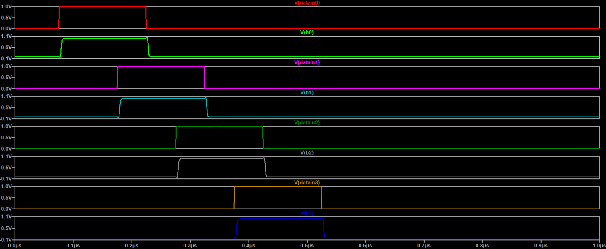
  
<em>Figure 4: SPICE Simulation Demonstrating Tristate Operation When EnableIn Toggles</em>

  

### Layout

The physical layout implements four parallel tristate buffer structures, one for each bit of the 4-bit data path. The layout ensures proper routing of power, ground, and signal lines while maintaining compact design for integration into the larger VSM architecture.

  

  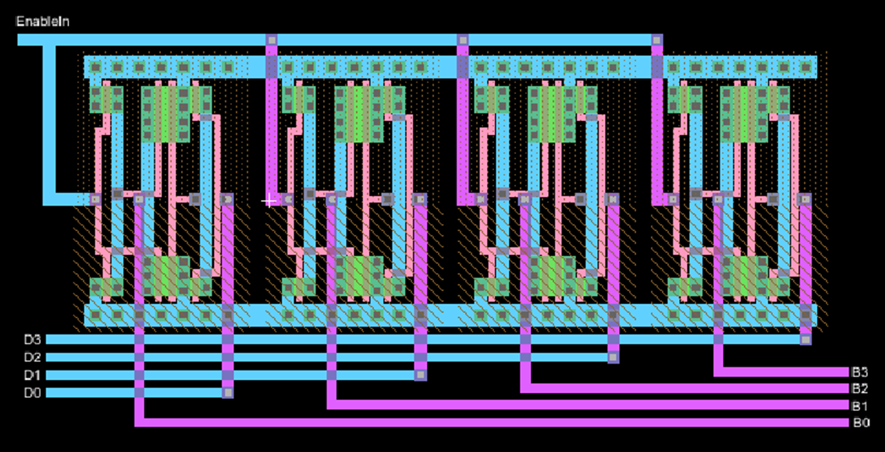
  
<em>Figure 5: Completed IN Register Layout Showing Four Parallel Buffer Structures</em>

  

  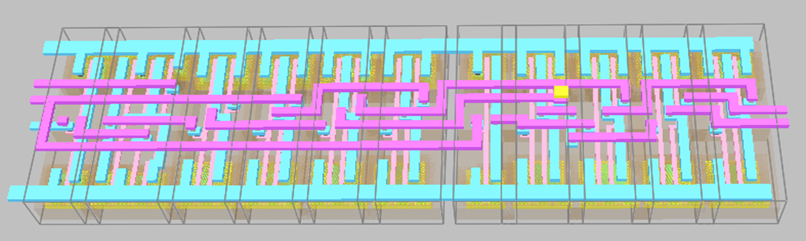
  
<em>Figure 6: 3D Rendering of IN Register Layout Showing Metal Layers and Interconnects</em>

  

## OUT Register

The OUT Register stores data from the IB_BUS and outputs it only when EnableOut is high. This register captures data on a clock edge and holds it until the next clock cycle, providing stable outputs for downstream logic.

### Initial Approach: D Flip-Flop from muddlib Library

Initially, muddlib D-Flip-Flops were used to implement the OUT Register. However, their two-phase clocking scheme caused double-triggering issues due to overlapping clocks.

  

  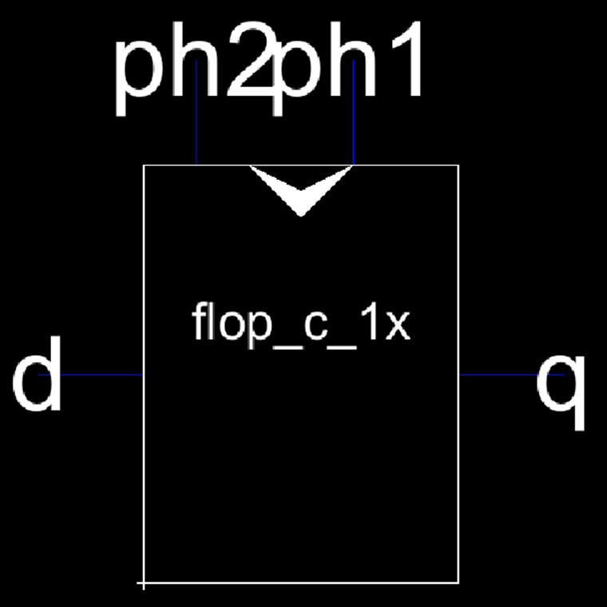
  
<em>Figure 7: mudLib Two-Phase D Flip-Flop Cell (ph2ph1 Configuration)</em>

  

### The Problem: Overlapping Clocks

The muddlib D flip-flop uses a master-slave architecture with two phases: PH1 and PH2. If these clock phases overlap (even when they are meant to be perfectly inverted), the flip-flop can trigger twice per clock cycle, causing incorrect operation and data corruption. This fundamental limitation necessitated the design of a custom D flip-flop.

  

  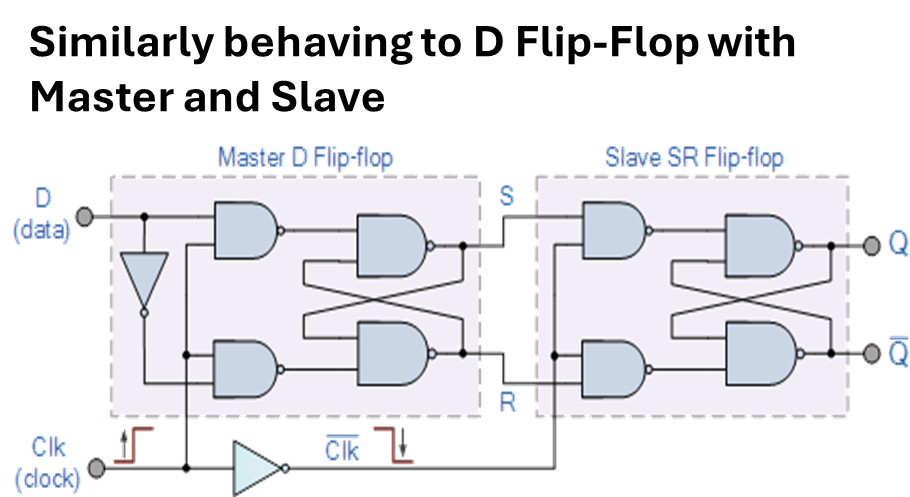
  
<em>Figure 8: Master-Slave D Flip-Flop Architecture Showing Two-Phase Clocking</em>

  

  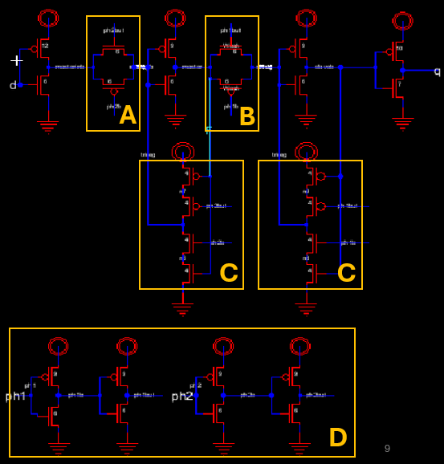
  
<em>Figure 9: Detailed Schematic of mudLib Two-Phase D Flip-Flop</em>

  

### Custom D Flip-Flop Design

To solve the overlapping clock problem, a custom positive-edge-triggered D flip-flop was designed from scratch.

#### First Attempt: Level-Triggered D-Flip-Flop

The initial design attempted to create a D flip-flop using SR latch logic. This approach used NAND gates to implement the Set-Reset functionality with clock gating.

  

  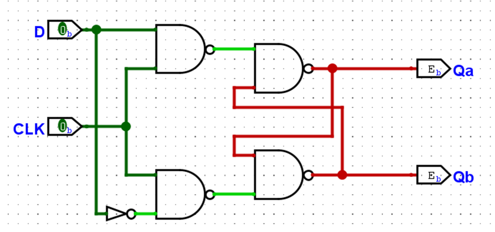
  
<em>Figure 10: Logic-Level Representation of First Custom D Flip-Flop Attempt Using SR Latch</em>

  

#### Transistor-Level Schematic

The schematic shows the transistor-level implementation with distinct sections:
- **Section A**: Master Latch (active on PH2)
- **Section B**: Slave Latch (active on PH1)  
- **Section C**: Logic between latches providing feedback path
- **Section D**: Inverters to create inverted clocks and buffered clock signals

  

  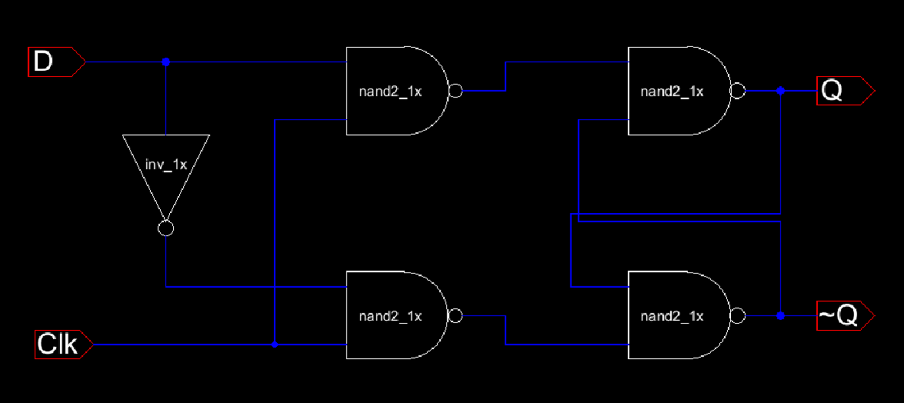
  
<em>Figure 11: Transistor-Level Schematic of Custom D Flip-Flop with Labeled Functional Blocks</em>

  

#### Adding Reset Logic

To add a reset capability without fully redesigning the D flip-flop, an AND gate was used to implement the reset functionality. The truth table ensures that when Reset is low (0), the D_in is forced to 0 regardless of the D input. Only when Reset is high (1) does D pass through to D_in.

  

  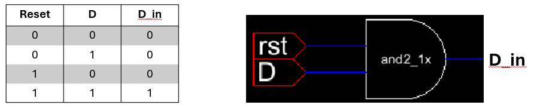
  
<em>Figure 12: Reset Logic Added Using AND Gate to Enforce D_in Behavior</em>

  

#### Simulation – Level-Triggered Behavior

The simulation revealed that the first attempt was not edge-triggered as intended. Instead, it exhibited level-triggered behavior where the output Q reflected the D input at all times when the clock was high. This is not the desired behavior for a proper edge-triggered flip-flop.

  

  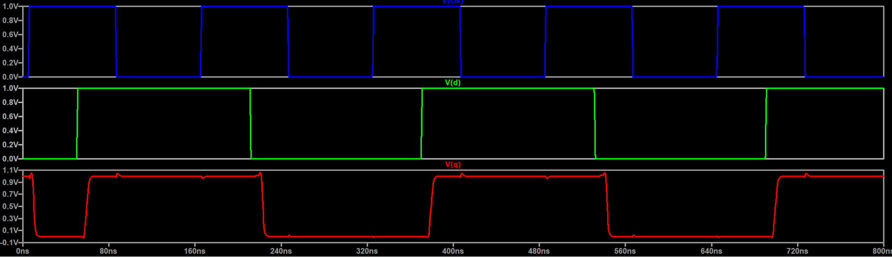
  
<em>Figure 13: Simulation Showing That First Attempt Was Level-Triggered, Not Edge-Triggered</em>

  

#### Final Edge-Triggered Design

After identifying the level-triggered behavior issue, the design was revised to create a true positive-edge-triggered D flip-flop. This design captures the D input only on the rising edge of the clock and holds that value until the next rising edge.

  

  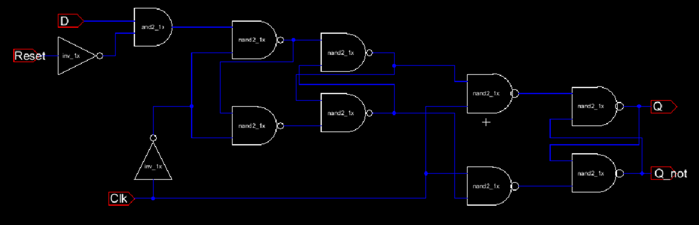
  
<em>Figure 14: Final Positive-Edge-Triggered Custom D Flip-Flop with Proper Edge Detection</em>

  

#### Final D-Flip-Flop Simulation

The final simulation confirms proper edge-triggered operation. The output Q changes only on the rising edge of the clock (Clk), capturing the value of D at that moment and holding it stable throughout the clock cycle.

  

  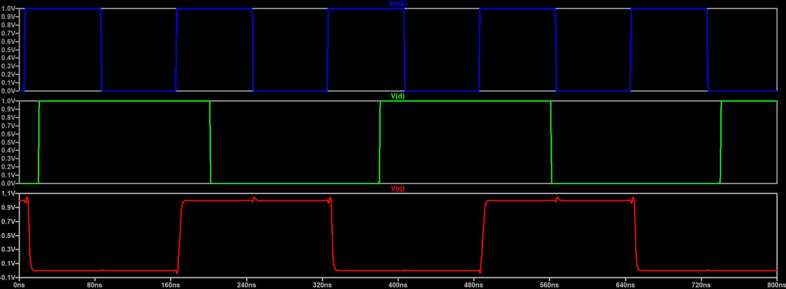
  
<em>Figure 15: SPICE Simulation of Final Edge-Triggered DFF Showing Correct Operation</em>

  

#### Layout of Final D-Flip-Flop

The layout implements the custom edge-triggered D flip-flop in physical form, carefully routing all transistor connections while minimizing area and ensuring proper operation at the target frequency.

  

  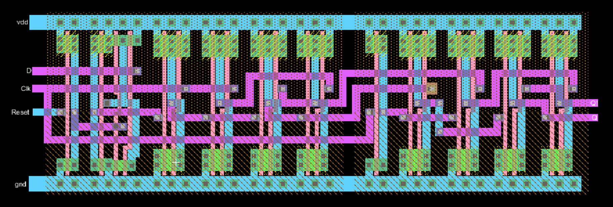
  
<em>Figure 16: Physical Layout of Final Custom D Flip-Flop</em>

  

### OUT Register Implementation

With the custom D flip-flop successfully designed and verified, the OUT Register was implemented using both the original muddlib flip-flops and the new custom design for comparison.

#### OUT Register Schematic (muddlib)

The initial OUT Register implementation used four muddlib D flip-flops in parallel to create a 4-bit register. Each flip-flop stores one bit of data from the IB bus.

  

  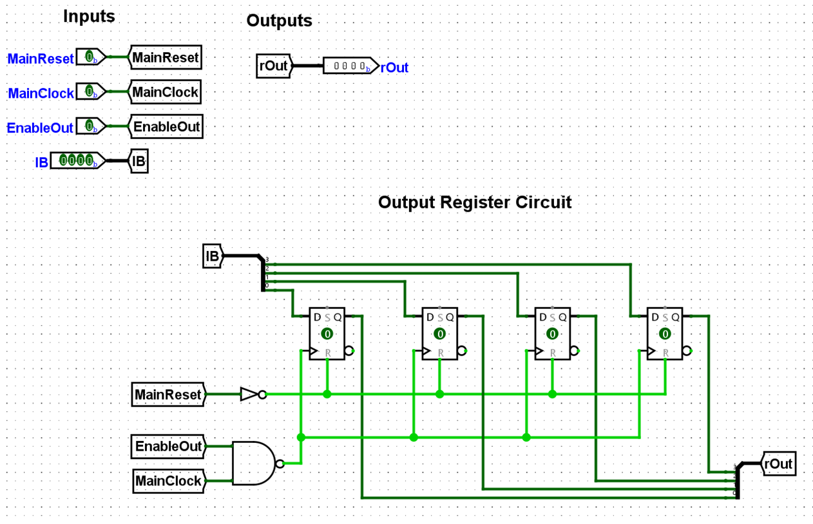
  
<em>Figure 17: OUT Register Schematic Using mudLib Flip-Flops (Logisim Block Diagram)</em>

  

  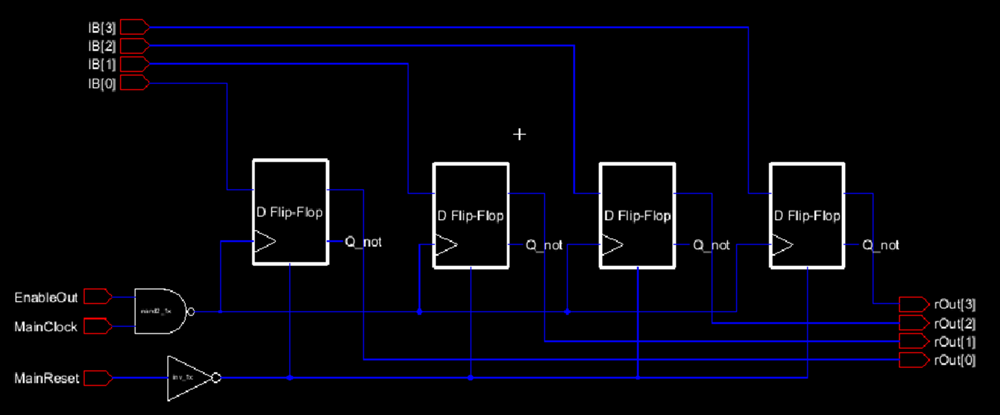
  
<em>Figure 18: OUT Register Transistor-Level Schematic Using mudLib Flip-Flops</em>

  

#### Simulation

The SPICE simulation demonstrates the OUT Register operating with both EnableOut and Reset signals active. The register properly captures data from the IB bus (IB[3:0]) on the clock edge and drives the outputs (rOut[3:0]) when enabled. The reset functionality ensures all outputs can be cleared to a known state.

  

  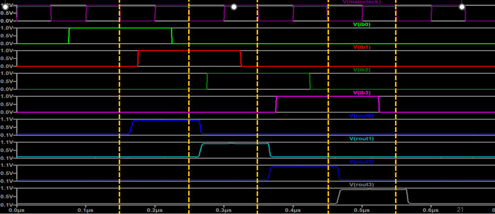
  
<em>Figure 19: SPICE Simulation of OUT Register with EnableOut and Reset Active</em>

  

#### Layout

The final OUT Register layout integrates four custom D flip-flop cells in parallel, with proper routing for the 4-bit data path, clock distribution, enable, and reset signals. The layout is optimized for area efficiency while maintaining signal integrity.

  

  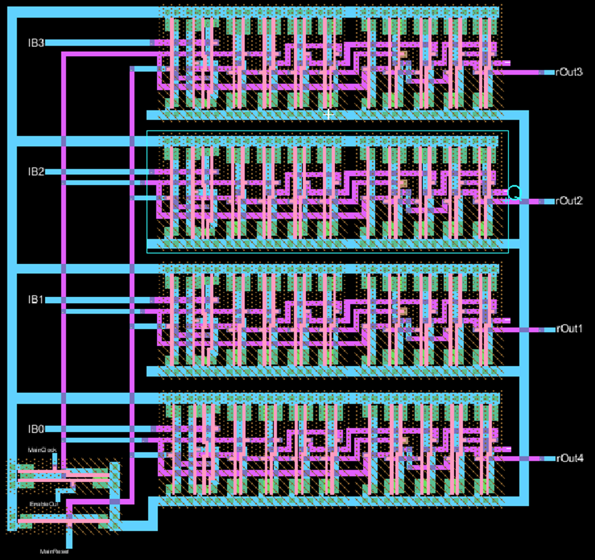
  
<em>Figure 20: OUT Register Physical Layout Using Four Custom DFF Cells</em>

  

  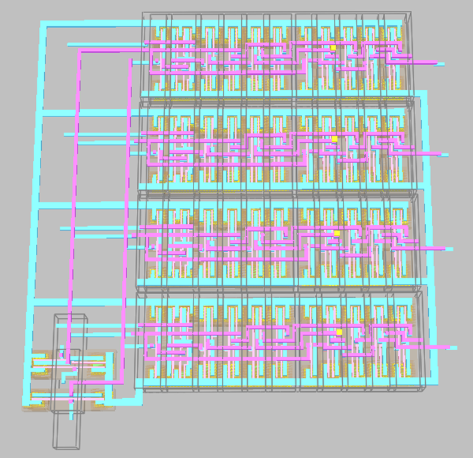
  
<em>Figure 21: 3D Rendering of OUT Register Layout Showing Complete Structure</em>

  

## Conclusion

This project successfully implemented both IN and OUT registers for the Very Simple Microprocessor (VSM) using the muddlib library. The IN Register provides controlled bus access through tristate buffers, while the OUT Register required the development of a custom edge-triggered D flip-flop to overcome limitations in the muddlib library's two-phase clocking scheme. Both registers were fully designed, simulated, and laid out, ready for integration into the complete VSM architecture.
