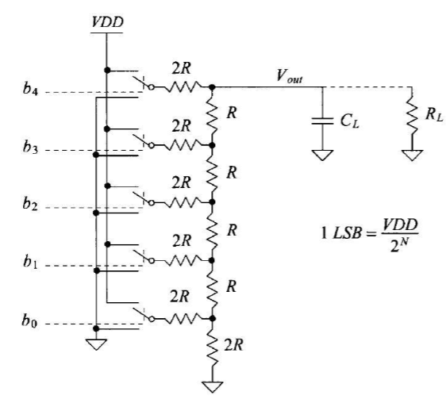
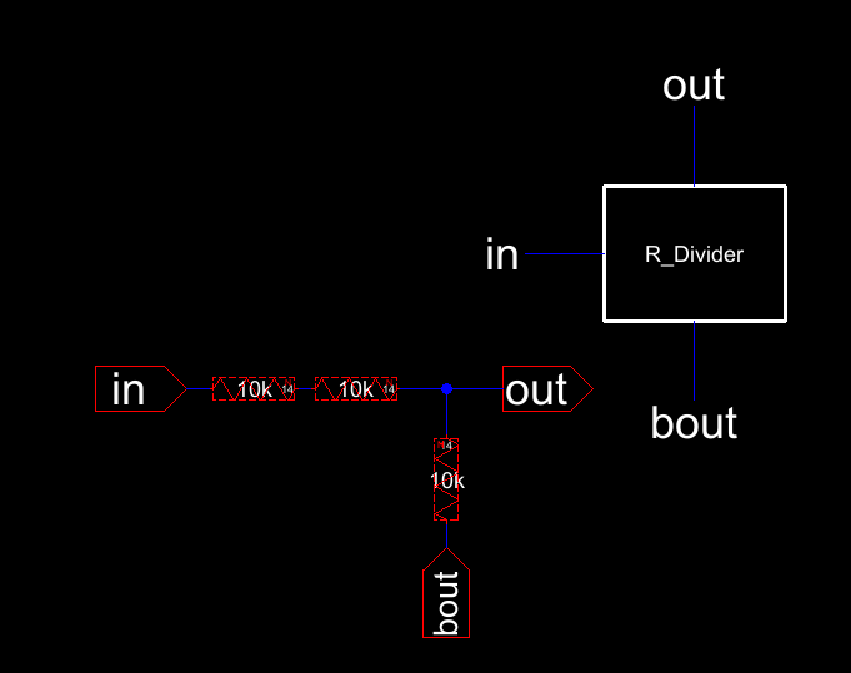
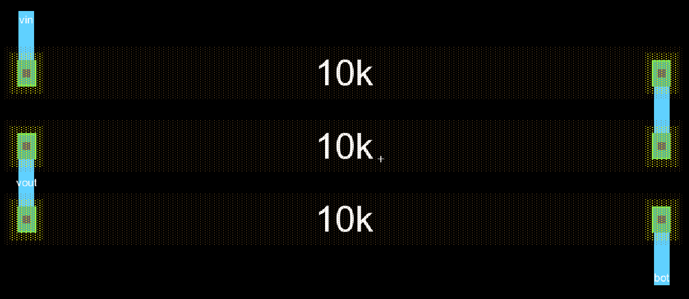
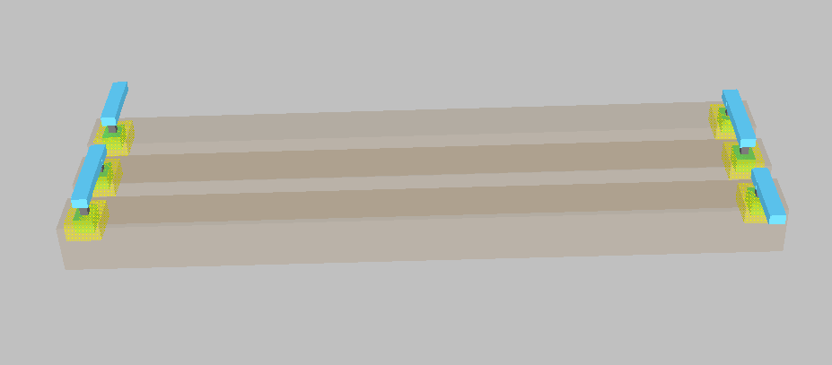
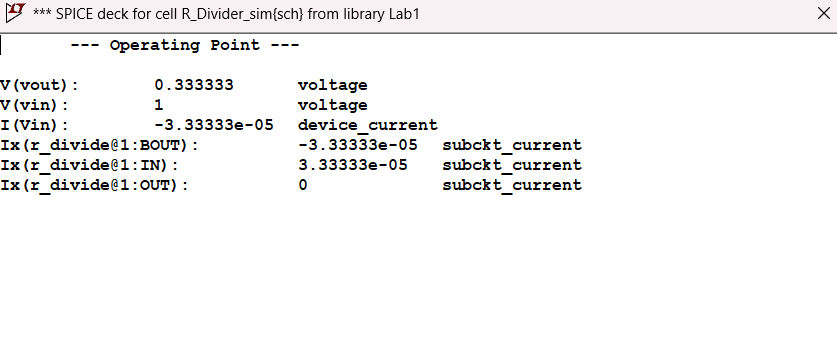
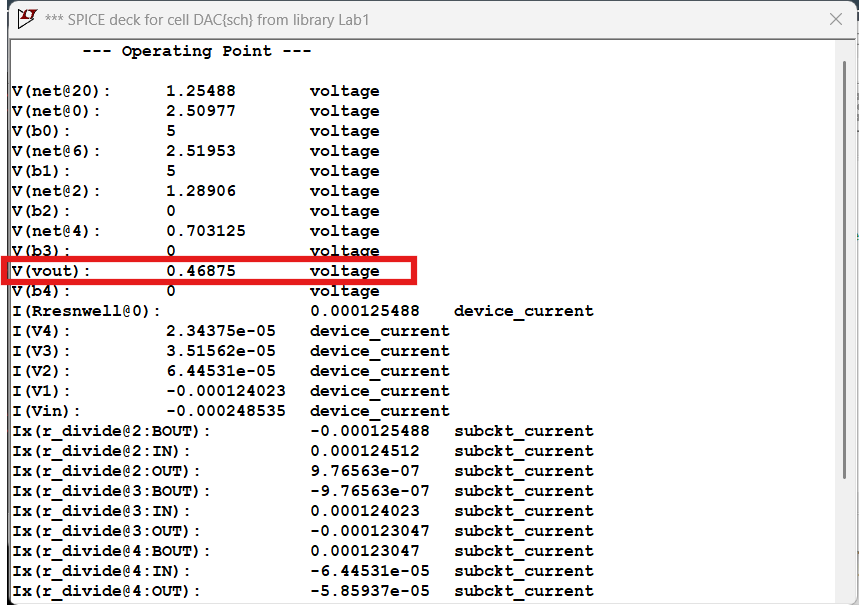
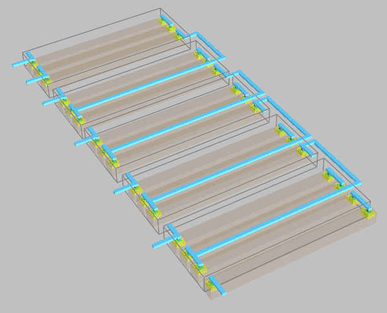
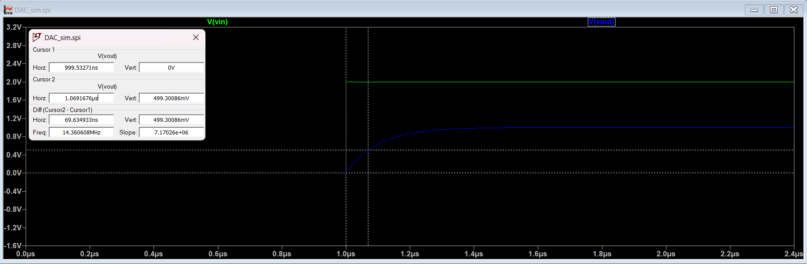

# Lab 1 Report

## Introduction

The Purpose of this lab report is to create a R-2R Ladder Digital to Analog Converter (DAC) schematic and layout.
We can do that by beginning with a simple voltage divider and cascode multiple of them to essentially create an array of almost identical voltage
dividers that have different inputs that correspond to a 5 bit binary number. The resulting output is an analog voltage.
The circuit diagram for the R-2R Ladder DAC that we are creating can be seen below in Figure 1.
<figure>
  

    
  

</figure>

  <figcaption><em>Figure 1: 5-bit R-2R DAC Circuit Diagram</em></figcaption>

  

## Hand Calculations and Understanding the DAC Circuit

In order to understand the function of the R-2R ladder, we need to look at the Thevenin equivalent of the circuit in different cases.
Based on the inputs b0-b4, the branches of the voltage divider differently contribute to the overall resistance network. 
We will take the binary value 00000 as an example where b0 is least significant bit.
We can then look at reducing the resistance network to just a single output resistance by applying simple resistor reductions.

1. 2R // 2R = R
2. R + R = 2R
3. 2R // 2R = R
4. R + R = 2R
5. 2R // 2R = R
6. R + R = 2R
7. 2R // 2R = R
8. R + R = 2R
9. 2R // 2R = R

The output resistance can be combined with a capacitive load to create a lowpass filter that eliminates noise, but has a resulting corresponding rise time. 
The rise time can be denoted as 0.7RC and thus, adding secondary resistive load in parallel with the capacitor decreases the overall resistance in this
RC network and results in a lower rise time.

## Voltage Divider

When we begin to create the voltage divider bit by bit, we start by drawing up a schematic where we create an N-Well resistor of resistance 10k Ohms.
This means that we have to calculate the Length and width of the N-Well. We can use the below equation to do that given that Rsq = 855 ohm/square
and the maximim width is 15.
 

  R = Rsq (L/W)

 

We can then decide to use a width of 14 and accordingly calculate the length as 163.73*lamda.
Then we can create the schematic and the corresponding icon as can be seen in figure 2.

<figure>
  

    
  

</figure>

  <figcaption><em>Figure 2: Voltage Divider Schematics and Icon</em></figcaption>

  

The layout is then created using an n-well and connections that go up to metal 1. The layout view can be seen in Figure 3 below

<figure>
  

    
  

</figure>

  <figcaption><em>Figure 3: Voltage Divider Layout</em></figcaption>

  

The layout is then viewed in 3D view to allow is to see the different layers including the metals. An image of that can be seen in Figure 4 below.

<figure>
  

    
  

</figure>

  <figcaption><em>Figure 4: Voltage Divider Layout in 3D View</em></figcaption>

  

The voltage divider is then simulated by using spice instructions to supply the input with a 1V input and view the output. 
The expected output is 0.33333V which is the voltage going through 1R.

The spice simulation results can be seen below in Figure 5.

<figure>
  

    
  

</figure>

  <figcaption><em>Figure 5: Voltage Divider SPICE Simulation Results</em></figcaption>

  

The same SPICE code was also ran on the layout to confirm that all connections are correct and that there are no major issues in the layout.

## R-2R DAC Schematics and Layout

The next step is to to use the Voltage divider blocks as the circuit blocks and stack them to enable the creation of the DAC. That can be
seen in Figure 6 below.

<figure>
  

    
  

</figure>

  <figcaption><em>Figure 6: DAC Schematics, Icon and SPICE code</em></figcaption>

  

The DAC was initially tested using the binary value 00011 and tested for the vout operating point. We can hand calculate what we expect
vout to be by using the concept of superposition where we are turning only 1 bit (b0 then b1) on at a time and calculating the resultant 
vout using voltage divider equations an then we can add both contributions to get the expected total vout to be 0.46875V. 

<figure>
  

    
  

</figure>

  <figcaption><em>Figure 7: DAC SPICE Simulation Results with Input 10000</em></figcaption>

  

The layout of the DAC was then created as shown in figures 8 and 9.

<figure>
  

    
  

</figure>

  <figcaption><em>Figure 8: DAC Layout</em></figcaption>

  

<figure>
  

    
  

</figure>

  <figcaption><em>Figure 9: DAC Layout in 3D View</em></figcaption>

  

The DAC was then tested using a digital input of 10000 and b4 connected to a pulse source (0 to VDD). The SPICE simulation instructions
for the transient were used to show and display the output voltgage wave form and calculate the delay. The results can be seen below.

<figure>
  

    
  

</figure>

  <figcaption><em>Figure 10: DAC SPICE Simulation Transient Results</em></figcaption>

  
