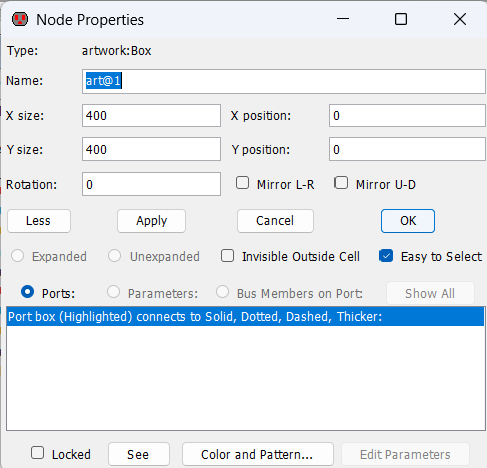
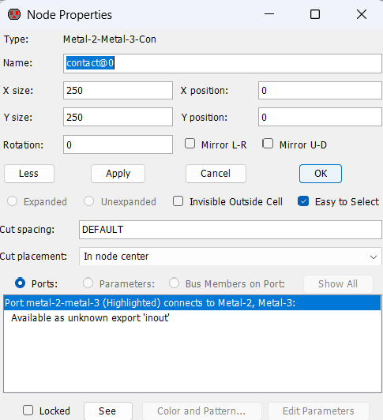
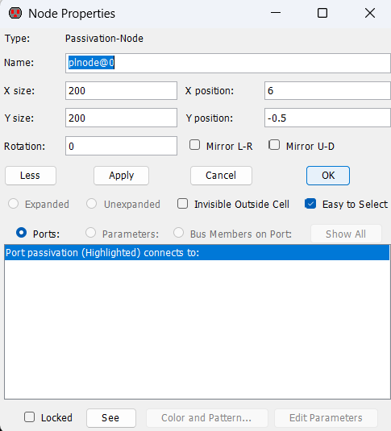
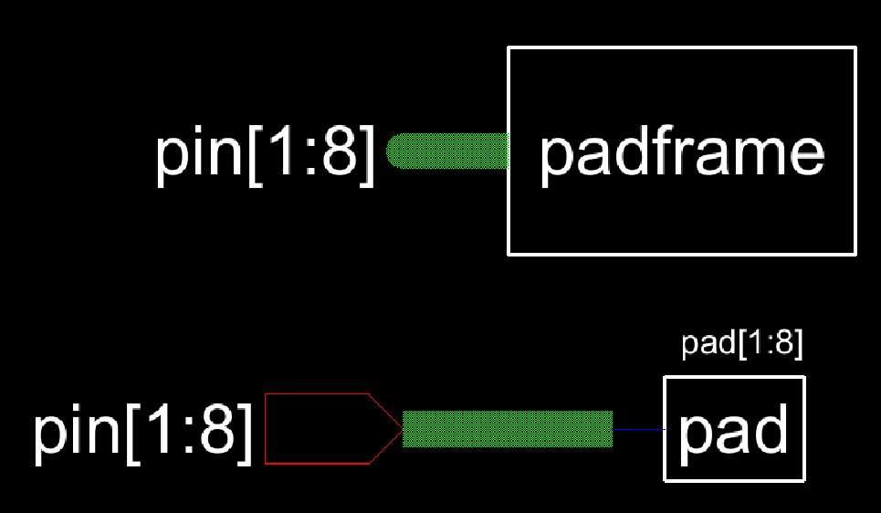
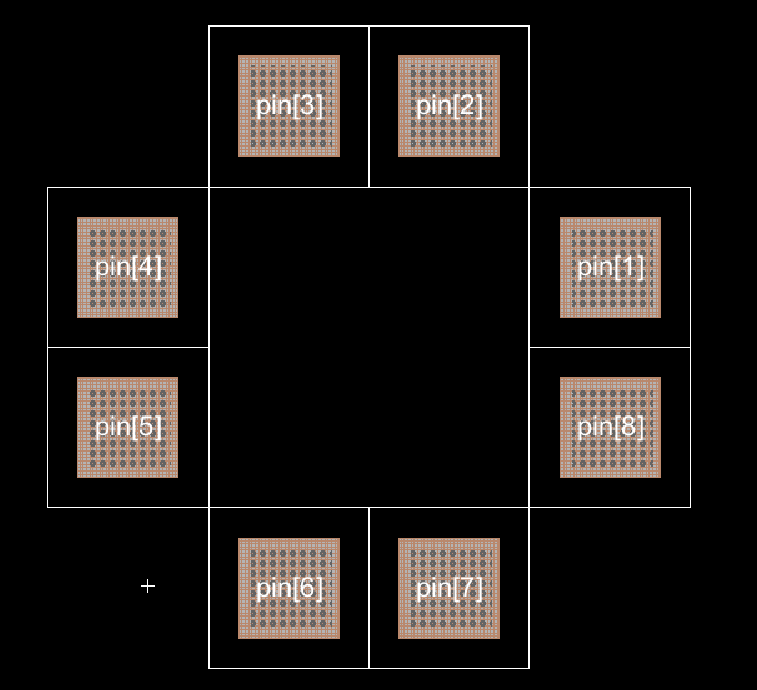
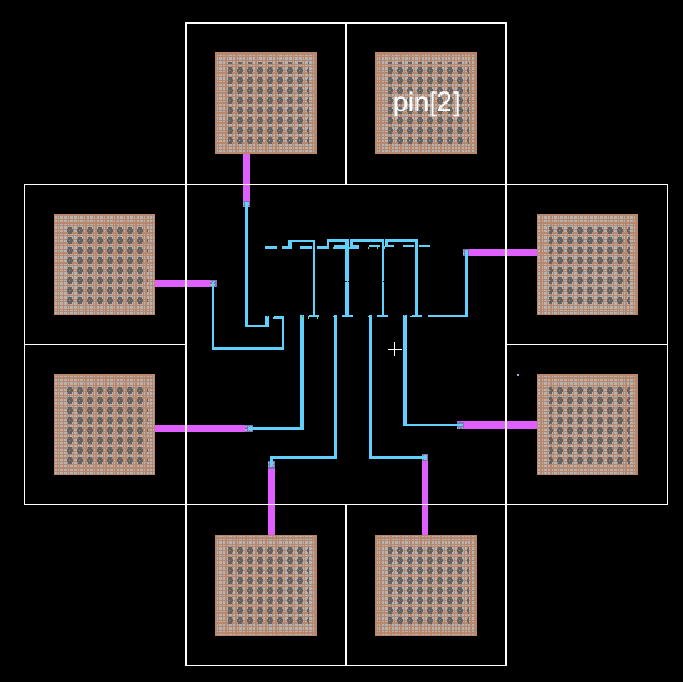
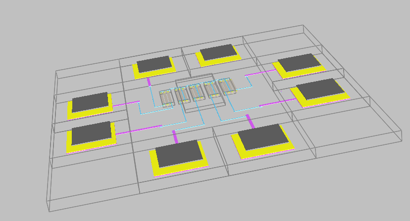

# Lab 2 Report

In this lab we are creating a padframe for the DAC. To do that we start by importing the DAC from the last lab, creating the individual pad schematic and layout
then finally creating the padframe layout.

First, to create the pad schematic, we just add a pin on its own. The schematic and icon can be seen below in Figure 1.
<figure>
  

    
  

</figure>

  <figcaption><em>Figure 1: Pad Schematic and Icon</em></figcaption>

  

We can then create the layout of the pad. The layout of the pad consists of a square art shape, a metal 2 to metal 3 connector and a passivation node.
The dimensions overall pad layout can be seen below in figure 2 and the dimensions of the parts of the layout can be seen in figures 3, 4 and 5.

<figure>
  

    
  

</figure>

  <figcaption><em>Figure 2: Pad Layout</em></figcaption>

  

<figure>
  

    
  

</figure>

  <figcaption><em>Figure 3: Pad Outer Shape Dimensions</em></figcaption>

  

<figure>
  

    
  

</figure>

  <figcaption><em>Figure 4: Pad Metal 2 to Metal 3 Contact Dimensions</em></figcaption>

  

<figure>
  

    
  

</figure>

  <figcaption><em>Figure 5: Pad Passivation Node Dimensions</em></figcaption>

  

Next this pad is used to make a padframe with multiple pads. The schematic was design using an input pin and an 8-wire bus since the DAC has 7 inputs.
The padframe schematic and icon can be seen below in Figure 6.

<figure>
  

    
  

</figure>

  <figcaption><em>Figure 6: Padframe Schematic and Icon</em></figcaption>

  

The Layout of the padframe was then created using the layout of a single pad by duplicating that to create a 4x4 array of pads. The corners and the center pads were then removed
to allow there to only be 8 pads in total. The nodes were then exported to enable connections. The resulting layout can be seen below in Figure 7.

<figure>
  

    
  

</figure>

  <figcaption><em>Figure 7: Padframe Layout</em></figcaption>

  

After the padframe was complete, the final IC was created which incorporates both the padframe and the DAC.
The schematic for the final IC was created using a square shape and 8 labelled (exported) wired that correspond to the 8 inputs each. The layout was then done as can be seen below in Figure 8.

<figure>
  

    
  

</figure>

  <figcaption><em>Figure 8: Final IC Layout</em></figcaption>

  

In Figure 8, we can see the blue metal 1 wires, the metal 1 to metal 2 connector (via) and the pink metal 2 wires. This is needed because the DAC connections live on metal 1 while the padframe 
connections live on metal 2, so we need a way to connect the metal 1 to metal 2.

The 3D view of the layout can be seen below in Figure 9.
<figure>
  

    
  

</figure>

  <figcaption><em>Figure 9: Final IC Layout 3D View </em></figcaption>

  
