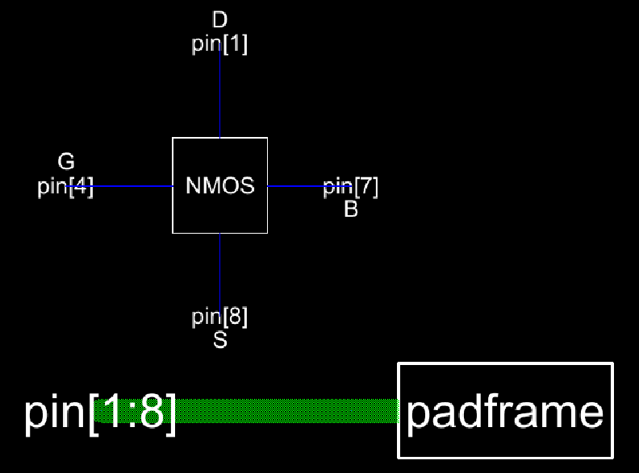

# Lab 3 Report

This lab is intended to create an IC with a single NMOS with pad protection.
In order to create the IC with ESD protection, the previous lab with cell views for pads and padframes is used as well as the library for the 
NMOS schematic and layout.

These are used to create first a protected pad followed by an ESD protected frame then adding the NMOS and connecting it to the padframe.

Figure 1 shows the schematic and icon for the nmos.

<figure>
  

    
  

</figure>

  <figcaption><em>Figure 1: NMOS Schematic and Icon</em></figcaption>

  

Figure 2 shows the layout for the nmos.

<figure>
  

    
  

</figure>

  <figcaption><em>Figure 2: NMOS Layout</em></figcaption>

  

The pad with esd was then created using 2 LEDs attached connected to the pad. Figure 3 shows the schematic and icon for the pad with esd.

<figure>
  

    
  

</figure>

  <figcaption><em>Figure 3: Schematic and Icon for the Pad with ESD</em></figcaption>

  

Figure 4 shows the layout of a singular pad with esd protection.

<figure>
  

    
  

</figure>

  <figcaption><em>Figure 4: Layout for the Pad with ESD</em></figcaption>

  

The layout of a padframe was then created using the 8 pads with esd protection. Figure 5 shows the schematic and icon of the esd protected 
padframe.

<figure>
  

    
  

</figure>

  <figcaption><em>Figure 5: Schematic and Icon for the Padframe without ESD</em></figcaption>

  

Figure 6 shows the layout of the same padframe with protection.

<figure>
  

    
  

</figure>

  <figcaption><em>Figure 6: Layout for the Padframe without ESD</em></figcaption>

  

To see the difference in the final IC, we then created a version of the final IC without protection and one with protection.
Figure 7 shows the schematic and icon for the final IC without protection.

<figure>
  

    
  

</figure>

  <figcaption><em>Figure 7: Schematic and Icon for the Final IC without ESD</em></figcaption>

  

Figure 8 shows the layout of the same padframe and Figure 9 shows the same layout in 3D view.

<figure>
  

    
  

</figure>

  <figcaption><em>Figure 8: Layout for the Final IC without ESD</em></figcaption>

  

<figure>
  

    
  

</figure>

  <figcaption><em>Figure 9: 3D View of Layout for the Final IC without ESD</em></figcaption>

  

Figure 10 shows the schematic and icon for the final IC with protection.

<figure>
  

    
  

</figure>

  <figcaption><em>Figure 10: Schematic and Icon for the Final IC with ESD</em></figcaption>

  

Figure 11 shows the layout of the same padframe and Figure 12 shows the same layout in 3D view.

<figure>
  

    
  

</figure>

  <figcaption><em>Figure 11: Layout for the Final IC with ESD</em></figcaption>

  

<figure>
  

    
  

</figure>

  <figcaption><em>Figure 12: 3D View of Layout for the Final IC with ESD</em></figcaption>

  
