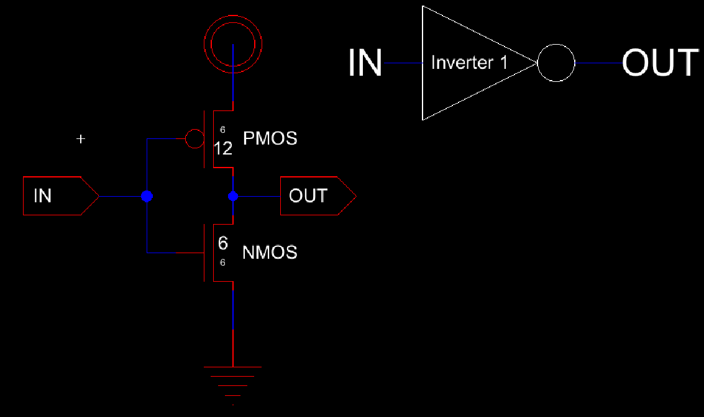
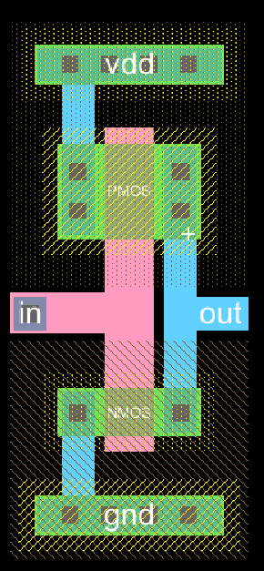
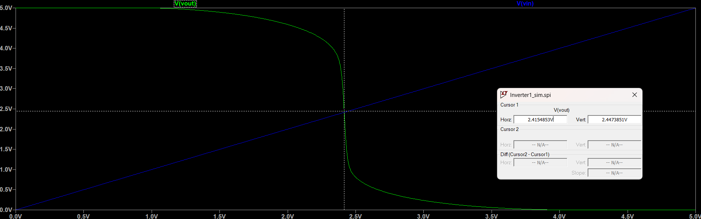
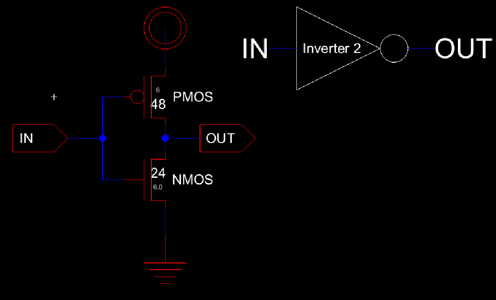
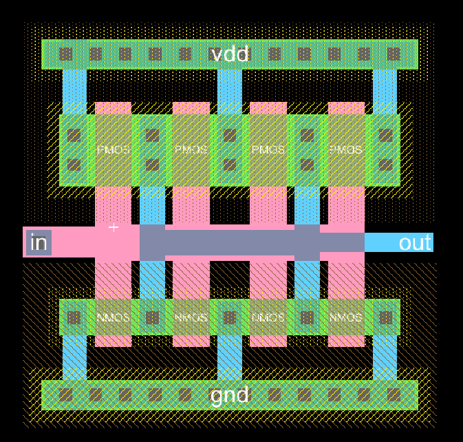
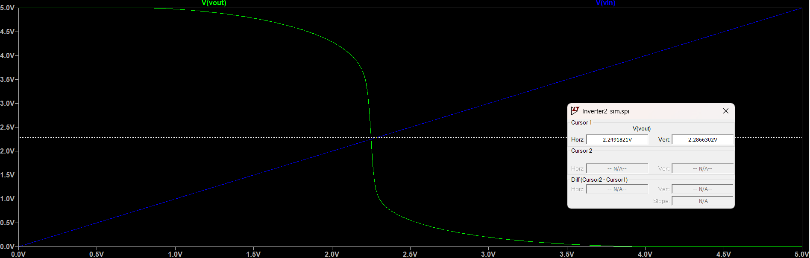
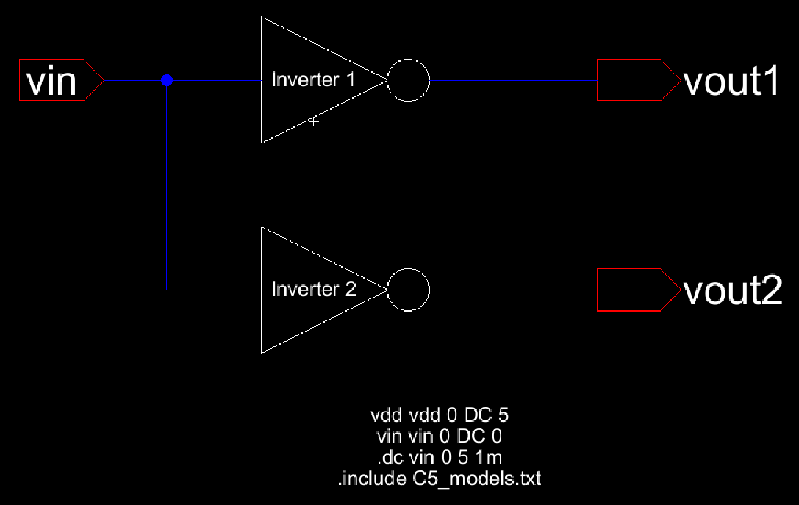
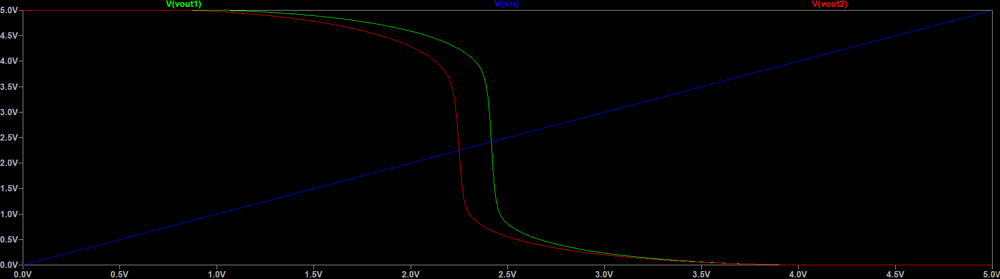
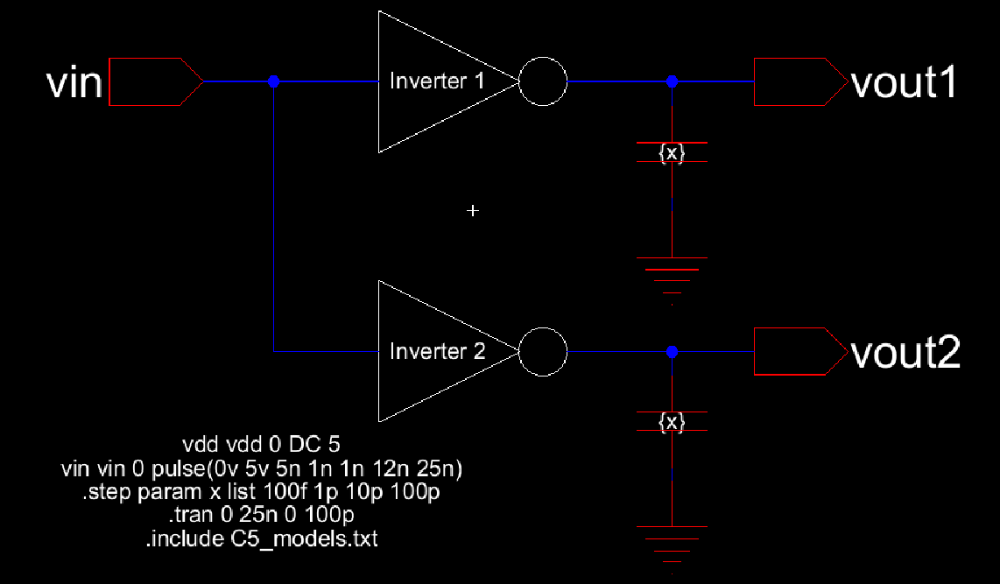
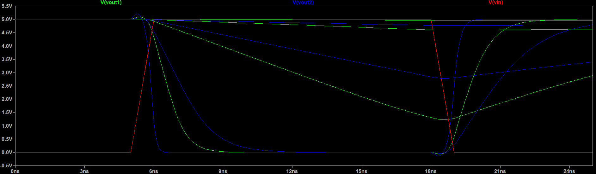

# Lab 4 Report

In this lab, we are creating two different inverters using different sizes for the PMOS and NMOS widths in order to view the effect of that on the switching point.
With that goal in mind, we create 2 different inverters (inverter 1 and inverter 2) then add them both to a single schematic to run simulations on.\
Electric VLSI was used to create all the following schematics and layouts and LT Spice was used to run the simulations.

## Inverter 1

Inverter 1 was created as can be seen in the schematic and layout below in Figures 1 and 2.

<figure>
  

    
  

</figure>

  <figcaption><em>Figure 1: Inverter 1 Schematic and Icon</em></figcaption>

  

<figure>
  

    
  

</figure>

  <figcaption><em>Figure 2: Inverter 1 Layout</em></figcaption>

  

A simulation was run on inverter 1 on its own to view the switching point and the plot can be seen below in Figure 3. Since the cursor was placed by visually 
locating the intersection, there is some human error associated with the produced value.

<figure>
  

    
  

</figure>

  <figcaption><em>Figure 3: Inverter 1 Switching Point Simulation Results</em></figcaption>

  

## Inverter 2

The same process was then repeated exactly to create Inverter 2 which has 4 times the width for each of the multipliers and uses 4 multipliers.

Inverter 2 was created as can be seen in the schematic and layout below in Figures 4 and 5.

<figure>
  

    
  

</figure>

  <figcaption><em>Figure 4: Inverter 2 Schematic and Icon</em></figcaption>

  

<figure>
  

    
  

</figure>

  <figcaption><em>Figure 5: Inverter 2 Layout</em></figcaption>

  

A simulation was run on inverter 1 on its own to view the switching point and the plot can be seen below in Figure 6. Since the cursor was placed by visually 
locating the intersection, there is some human error associated with the produced value.

<figure>
  

    
  

</figure>

  <figcaption><em>Figure 6: Inverter 2 Switching Point Simulation Results</em></figcaption>

  

## Combined Simulations

The inverters were then combined as can be seen in the schematic in Figure 7.

<figure>
  

    
  

</figure>

  <figcaption><em>Figure 7: Combined Inverters Schematic</em></figcaption>

  

Simulations are then run on this schematic. First, we are testing for the switching points of the combined inverters Below in Figure 8 is the switching point 
simulation results.

<figure>
  

    
  

</figure>

  <figcaption><em>Figure 8: Combined Inverters Switching Point Sim Results</em></figcaption>

  

From that we can see that inverter 1 has a higher switching point.

We can then add loading capacitors and attempt to simulate the response at different loading impedances. The schematic to do that can be seen below in figure 9 
for cload values of 100fF, 1pF, 10pF, and 100pF.

<figure>
  

    
  

</figure>

  <figcaption><em>Figure 9: Combined Inverters with cload Schematic</em></figcaption>

  

The simulation was then run and the results for the first loading conditions can be seen below in Figure 10.

<figure>
  

    
  

</figure>

  <figcaption><em>Figure 10: Combined Inverters Sim Results with cload Values 100fF, 1pF, 10pF, and 100pF</em></figcaption>

  

In these results, we can see that higher load impedance causes a higher response time for both inverters. We can also see that Inverter 2 has an overall faster 
response. 
