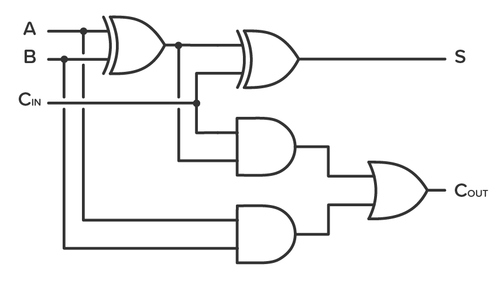
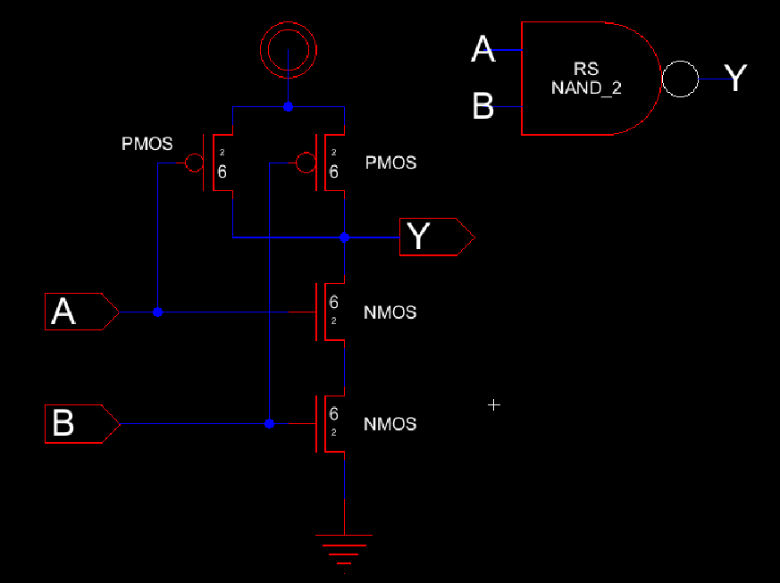
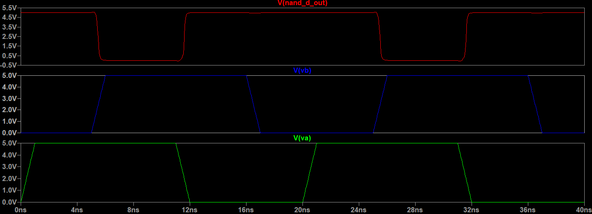

# Lab 5
## Introduction
In this lab, we are creating a full adder using NAND gates and XOR gates. In order to achieve that, the NAND, NOT, and XOR gates are created.
Next these gates are used to design the FA as can be seen in the circuit diagram below in Figure 1.

   
<figure>
  

    
  

</figure>

  <figcaption><em>Figure 1: Full Adder Circuit Diagram </em></figcaption>

  

## NAND Gate
First, the NAND gate schematic was built, and the schematic and icon can be seen in Figure 2.

   
<figure>
  

    
  

</figure>

  <figcaption><em>Figure 2: NAND Gate Schematic and Icon </em></figcaption>

  

The NAND gate transition is simulated as can be seen in Figure 3.

   
<figure>
  

    
  

</figure>

  <figcaption><em>Figure 3: NAND Gate Transition Delay Schematic </em></figcaption>

  

The simulation results can be seen in Figure 4

   
<figure>
  

    
  

</figure>

  <figcaption><em>Figure 4: NAND Gate Transition Simulation Results </em></figcaption>

  

The gate is given input pulses that allow us to simulate the truth table and the results were checked to mae sure that the only time the 
output is 1 is when both inputs are 0. Below in Figure 5 is the schamtic for the truth table simulation.

   
<figure>
  

    
  

</figure>

  <figcaption><em>Figure 5: NAND Gate Truth Table Schematic </em></figcaption>

  

The simulation results can be seen in Figure 6

   
<figure>
  

    
  

</figure>

  <figcaption><em>Figure 6: NAND Gate Truth Table Simulation Results </em></figcaption>

  

Next, the layout for the NAND gate was created as can be seen in Figure 7.

   
<figure>
  

    
  

</figure>

  <figcaption><em>Figure 7: NAND Gate Layout </em></figcaption>

  

The 3D view of the simulation can be seen below in Figure 8.

   
<figure>
  

    
  

</figure>

  <figcaption><em>Figure 8: NAND Gate Layout 3D View </em></figcaption>

  

## NOT Gate

The same process was repeated to create a NOT Gate. Figure 9 shows the schematic and icon of the NOT gate.

   
<figure>
  

    
  

</figure>

  <figcaption><em>Figure 9: NOT Gate Schematic and Icon </em></figcaption>

  

The NOT gate transition is simulated as can be seen in Figure 10.

   
<figure>
  

    
  

</figure>

  <figcaption><em>Figure 10: NOT Gate Transition Delay Schematic </em></figcaption>

  

The simulation results can be seen in Figure 11

   
<figure>
  

    
  

</figure>

  <figcaption><em>Figure 11: NOT Gate Transition Simulation Results </em></figcaption>

  

Next, the layout for the NAND gate was created as can be seen in Figure 12.

   
<figure>
  

    
  

</figure>

  <figcaption><em>Figure 12: NOT Gate Layout </em></figcaption>

  

The 3D view of the simulation can be seen below in Figure 13.

   
<figure>
  

    
  

</figure>

  <figcaption><em>Figure 13: NOT Gate Layout 3D View </em></figcaption>

  

## XOR Gate

The same process was again repeated to create an XOR gate. The XOR gate schematic was built, and the schematic and icon can be seen in Figure 14.

   
<figure>
  

    
  

</figure>

  <figcaption><em>Figure 14: XOR Gate Schematic and Icon </em></figcaption>

  

The XOR gate transition is simulated as can be seen in Figure 15.

   
<figure>
  

    
  

</figure>

  <figcaption><em>Figure 15: XOR Gate Transition Delay Schematic </em></figcaption>

  

The simulation results can be seen in Figure 16.

   
<figure>
  

    
  

</figure>

  <figcaption><em>Figure 16: XOR Gate Transition Simulation Results </em></figcaption>

  

The gate is given input pulses that allow us to simulate the truth table and the results were checked to mae sure that the only time the 
output is 1 is when both inputs are opposite. Below in Figure 17 is the schamtic for the truth table simulation.

   
<figure>
  

    
  

</figure>

  <figcaption><em>Figure 17: XOR Gate Truth Table Schematic </em></figcaption>

  

The simulation results can be seen in Figure 18.

   
<figure>
  

    
  

</figure>

  <figcaption><em>Figure 18: XOR Gate Truth Table Simulation Results </em></figcaption>

  

Next, the layout for the XOR gate was created as can be seen in Figure 19.

   
<figure>
  

    
  

</figure>

  <figcaption><em>Figure 19: XOR Gate Layout </em></figcaption>

  

The 3D view of the simulation can be seen below in Figure 20.

   
<figure>
  

    
  

</figure>

  <figcaption><em>Figure 20: XOR Gate Layout 3D View </em></figcaption>

  

## Full Adder

After all the gates are built, NAND and XOR gates are used to build the Full Adder as can be seen in Figure 1.
Below is the built schematic and icon in Figure 21.

   
<figure>
  

    
  

</figure>

  <figcaption><em>Figure 21: Full Adder Schematic and Icon </em></figcaption>

  

The Full adder Truth Table was simulated as can be seen below in Figure 22.

   
<figure>
  

    
  

</figure>

  <figcaption><em>Figure 22: Full Adder Truth Table Schematic </em></figcaption>

  

The simulation results can be seen in Figure 23.

   
<figure>
  

    
  

</figure>

  <figcaption><em>Figure 23: Full Adder Truth Table Simulation Results </em></figcaption>

  

Next, the layout for the Full Adder was created as can be seen in Figure 24.

   
<figure>
  

    
  

</figure>

  <figcaption><em>Figure 24: Full Adder Layout </em></figcaption>

  

The 3D view of the simulation can be seen below in Figure 25.

   
<figure>
  

    
  

</figure>

  <figcaption><em>Figure 25: Full Adder Layout 3D View </em></figcaption>

  

