# Lab 6
In this lab, we are creating a Ring Oscillator, a 3-phase Charge pump and a regulator in order to put them together and design a 2V voltage generator.

In all the components, the capacitor and resistor values are too large to be placed in the layout since they would take up too much area, so they are 
replaced with symbols to represent where they should be connected. In a real situation, there could be pads placed that connect to the top metal layer 
(metal 3) to allow the resistors and capacitors to be added to a PCB which can connect the built-in connectors to the actual passive devices.

## 3-Phase Charge Pump

Figure 1 shows the schematic and icon of the 3 Phase Charge Pump gate.

   
<figure>
  

    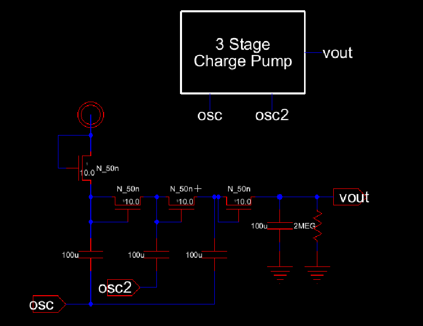
  

</figure>

  <figcaption><em>Figure 1: Charge Pump Schematic and Icon </em></figcaption>

  

The charge pump schematic was the simulated as follows in Figure 2.

   
<figure>
  

    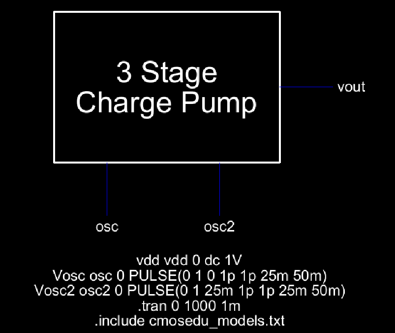
  

</figure>

  <figcaption><em>Figure 2: Charge Pump Sim Schematic </em></figcaption>

  

The simulation results can be seen in Figure 3

   
<figure>
  

    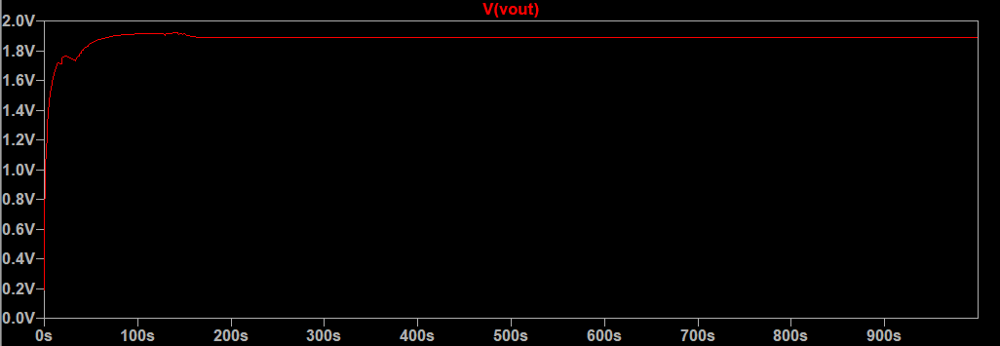
  

</figure>

  <figcaption><em>Figure 3: Charge Pump Simulation Results </em></figcaption>

  

Next, the layout was created as can be seen in Figure 4.

   
<figure>
  

    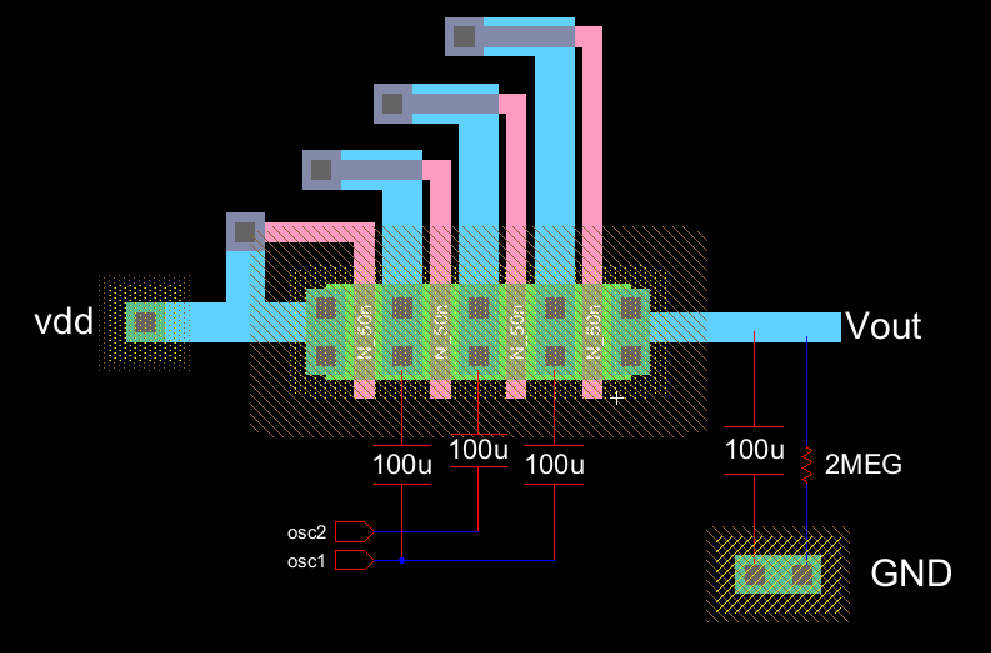
  

</figure>

  <figcaption><em>Figure 4: Charge Pump Layout </em></figcaption>

  

The 3D view of the layout can be seen below in Figure 5.

   
<figure>
  

    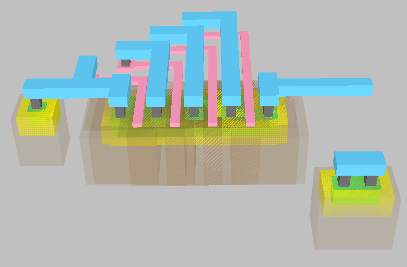
  

</figure>

  <figcaption><em>Figure 5: Charge Pump 3D View </em></figcaption>

  

## Ring Oscillator

Figure 6 shows the schematic and icon of the Ring Oscillator gate.

   
<figure>
  

    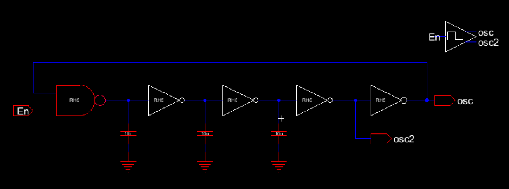
  

</figure>

  <figcaption><em>Figure 6: Ring Oscillator Schematic and Icon </em></figcaption>

  

The schematic was the simulated as follows in Figure 7.

   
<figure>
  

    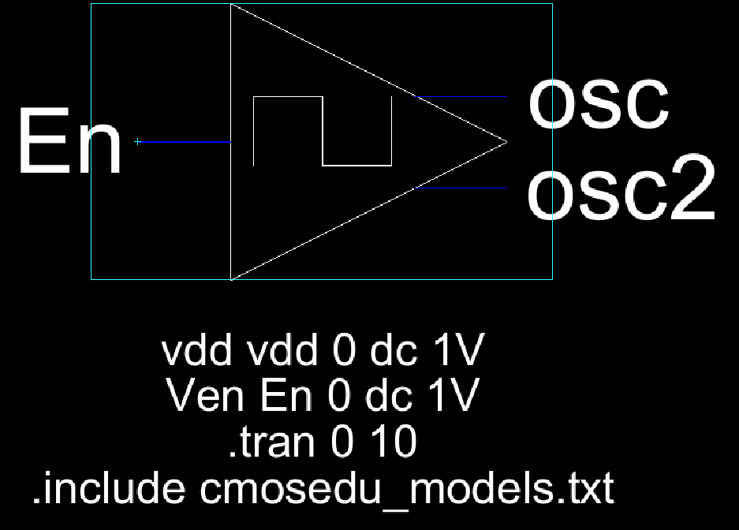
  

</figure>

  <figcaption><em>Figure 7: Ring Oscillator Sim Schematic </em></figcaption>

  

The simulation results can be seen in Figure 8.

   
<figure>
  

    
  

</figure>

  <figcaption><em>Figure 8: Ring Oscillator Simulation Results </em></figcaption>

  

Next, the layout was created as can be seen in Figure 9.

   
<figure>
  

    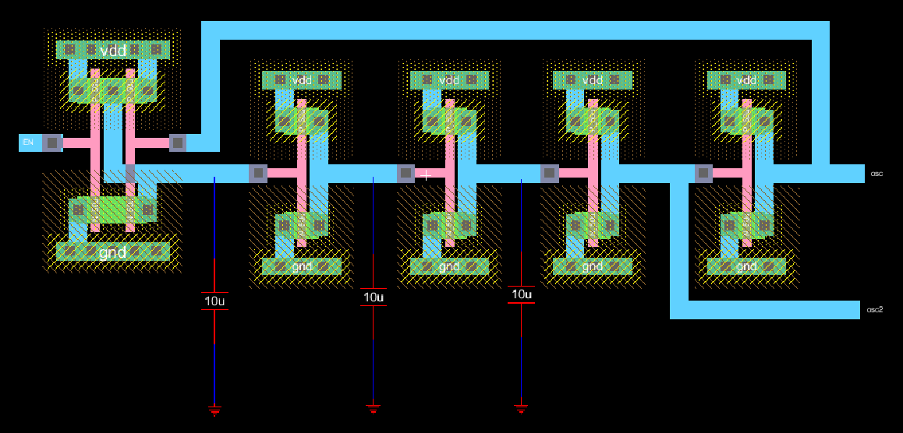
  

</figure>

  <figcaption><em>Figure 9: Ring Oscillator Layout </em></figcaption>

  

The 3D view of the layout can be seen below in Figure 10.

   
<figure>
  

    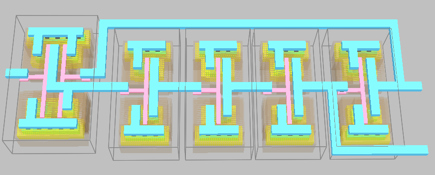
  

</figure>

  <figcaption><em>Figure 10: Ring Oscillator 3D View </em></figcaption>

  

## Regulator

Figure 11 shows the schematic and icon of the Regulator.

   
<figure>
  

    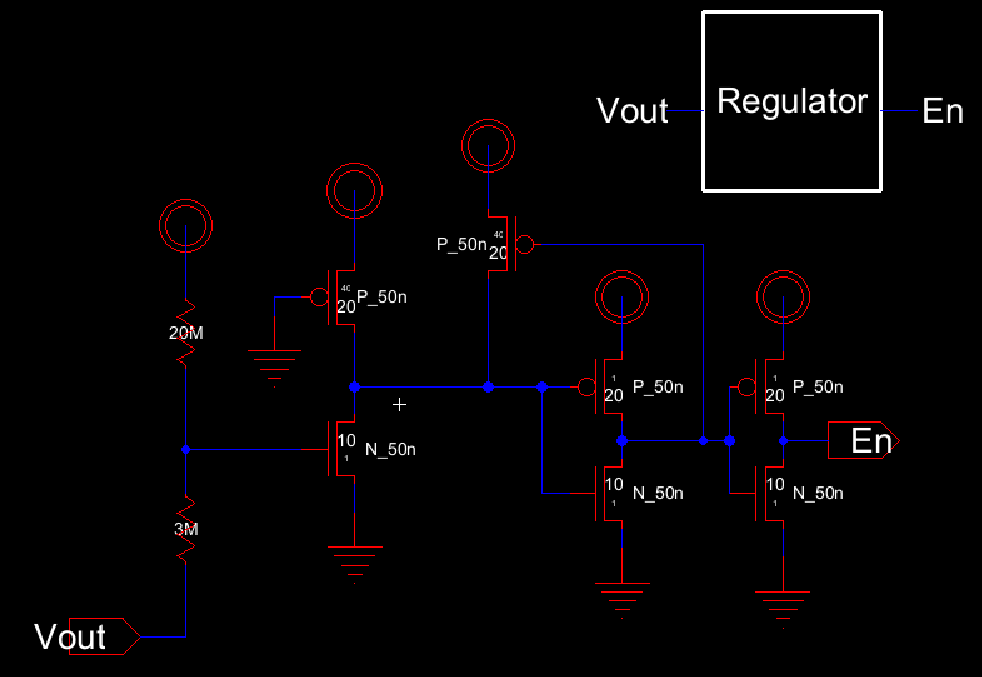
  

</figure>

  <figcaption><em>Figure 11: Regulator Schematic and Icon </em></figcaption>

  

The Regulator schematic was the simulated as follows in Figure 12.

   
<figure>
  

    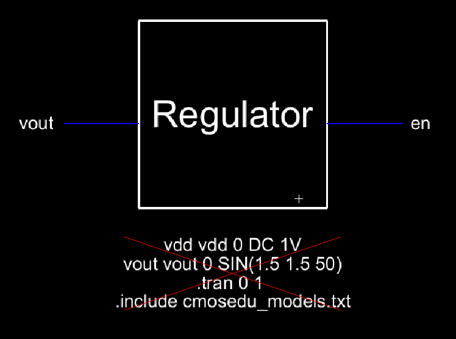
  

</figure>

  <figcaption><em>Figure 12: Regulator Sim Schematic </em></figcaption>

  

The simulation results can be seen in Figure 13

   
<figure>
  

    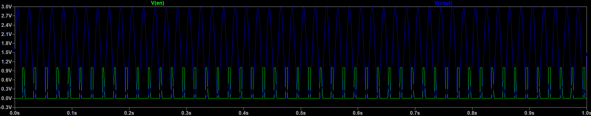
  

</figure>

  <figcaption><em>Figure 13: Regulator Simulation Results </em></figcaption>

  

Next, the layout was created as can be seen in Figure 14.

   
<figure>
  

    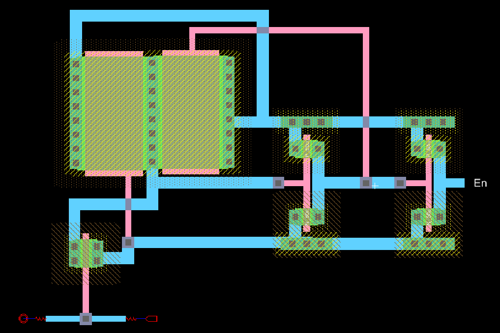
  

</figure>

  <figcaption><em>Figure 14: Regulator Layout </em></figcaption>

  

## Combined Blocks

Finally, the blocks are combined in a schematic as shown below in Figure 15.

   
<figure>
  

    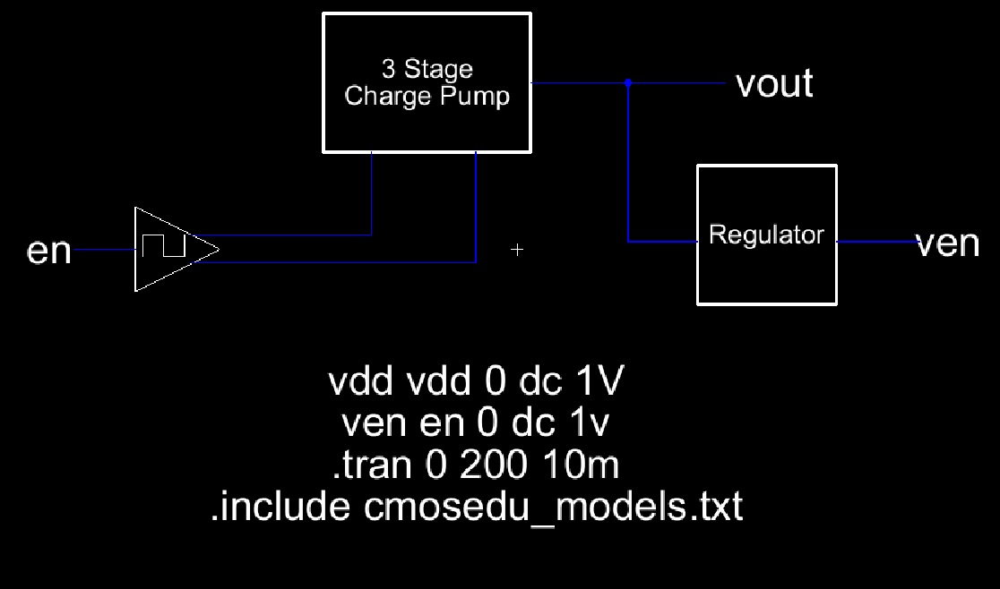
  

</figure>

  <figcaption><em>Figure 15: Combined Circuit Schematic</em></figcaption>

  

The schematic was the simulated as follows in Figure 16.

   
<figure>
  

    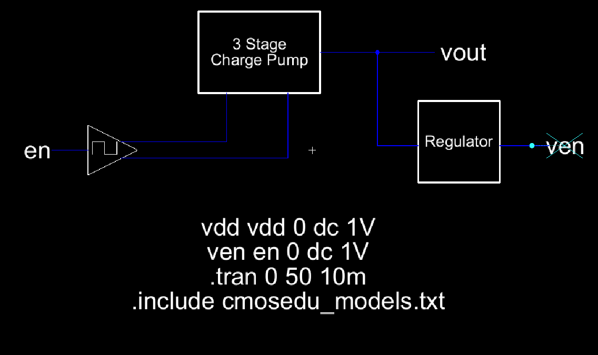
  

</figure>

  <figcaption><em>Figure 16: Combined Circuit Sim Schematic </em></figcaption>

  

The simulation results can be seen in Figure 17.

   
<figure>
  

    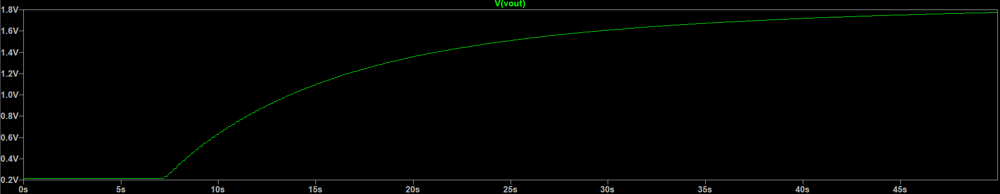
  

</figure>

  <figcaption><em>Figure 17: Combined Circuit Simulation Results </em></figcaption>

  

Next, the layout was created as can be seen in Figure 18.

   
<figure>
  

    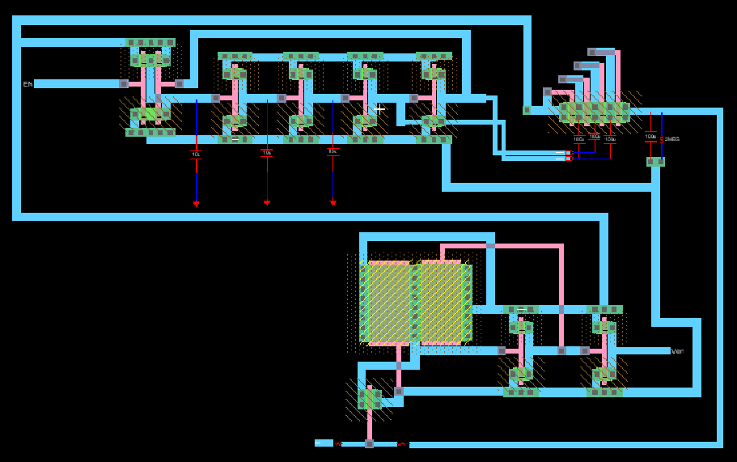
  

</figure>

  <figcaption><em>Figure 18: Combined Circuit Layout </em></figcaption>

  
